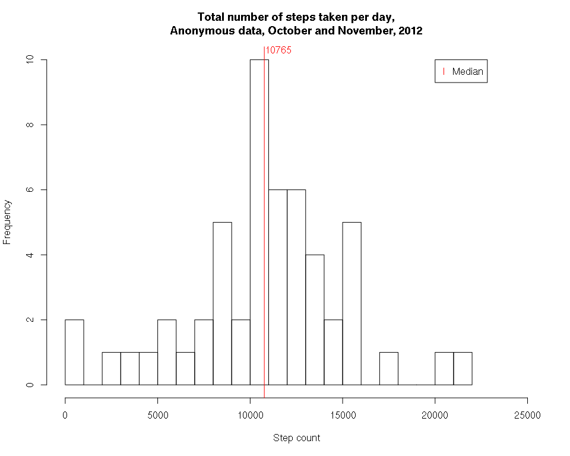
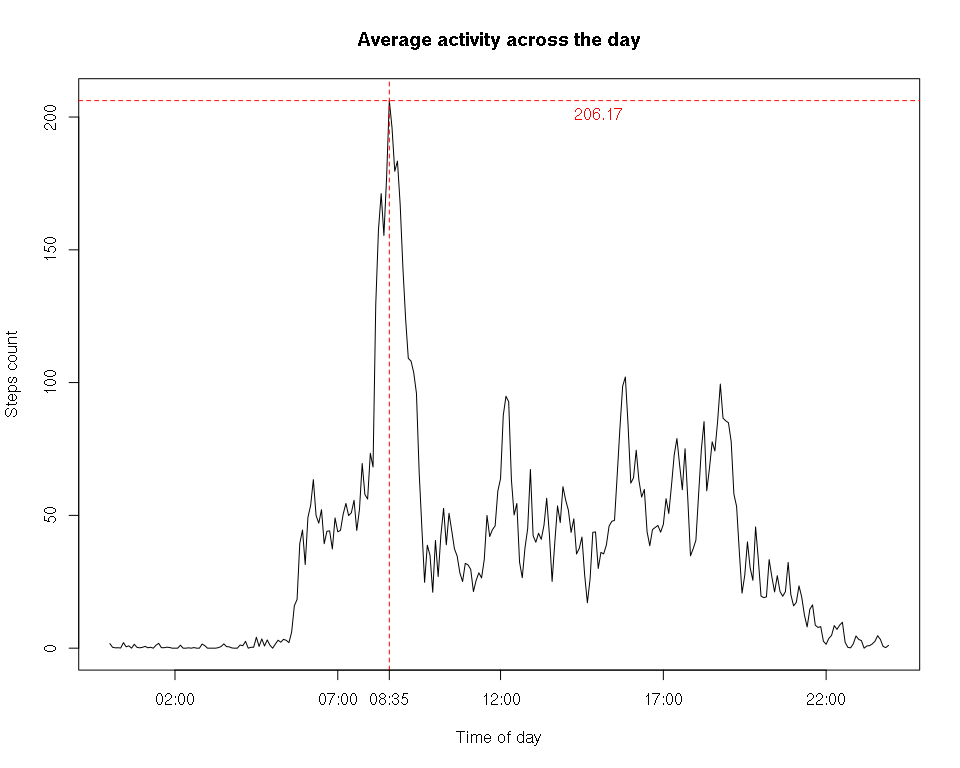
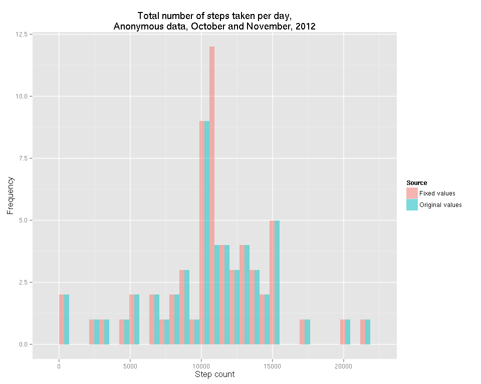
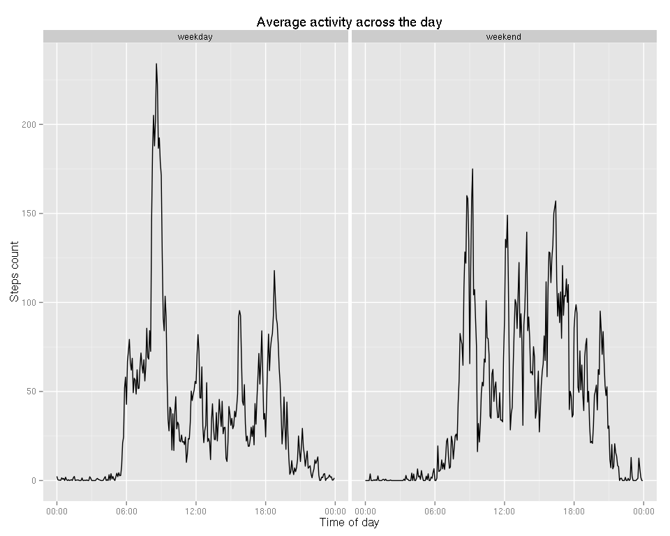
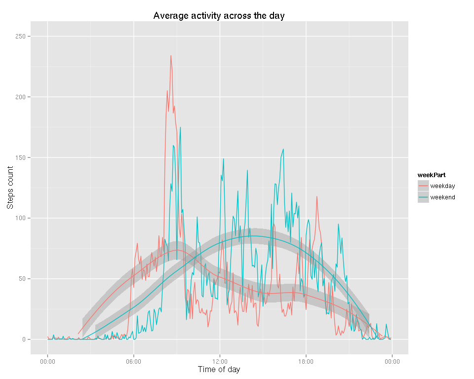

# Reproducible Research: Peer Assessment 1
# Activity data processing example

This document is created in order to demonstrate ability to create reports using Rmd (knitr).

Original dataset: https://d396qusza40orc.cloudfront.net/repdata%2Fdata%2Factivity.zip

The variables included in this dataset are:

* steps: Number of steps taking in a 5-minute interval (missing values are coded as NA)

* date: The date on which the measurement was taken in YYYY-MM-DD format

* interval: Identifier for the 5-minute interval in which measurement was taken

## Loading and preprocessing the data

Show any code that is needed to

1. Load the data (i.e. read.csv())

2. Process/transform the data (if necessary) into a format suitable for your analysis

### Loading all libraries


```r
library(dplyr)
library(lubridate)
library(ggplot2)
Sys.setlocale("LC_TIME", "C")
```

```
## [1] "C"
```

### Loading data
We assume that file is already in that folder.


```r
unzip("activity.zip")
activity <- tbl_df(read.csv("activity.csv", na.strings = 'NA')) %>%
  mutate(interval = parse_date_time(interval, c("%H%M", "%M")))
message('Here is the raw data:')
```

```
## Here is the raw data:
```

```r
str(activity)
```

```
## Classes 'tbl_df', 'tbl' and 'data.frame':	17568 obs. of  3 variables:
##  $ steps   : int  NA NA NA NA NA NA NA NA NA NA ...
##  $ date    : Factor w/ 61 levels "2012-10-01","2012-10-02",..: 1 1 1 1 1 1 1 1 1 1 ...
##  $ interval: POSIXct, format: "0-01-01 00:00:00" "0-01-01 00:05:00" ...
```

## What is mean total number of steps taken per day?

For this part of the assignment, you can ignore the missing values in the dataset.

1. Calculate the total number of steps taken per day
2. If you do not understand the difference between a histogram and a barplot, research the difference between them. Make a histogram of the total number of steps taken each day
3. Calculate and report the mean and median of the total number of steps taken per day


```r
totalActivityByDay <- activity %>% group_by(date) %>% summarise(daySteps = sum(steps))
hist(totalActivityByDay$daySteps,
     breaks = 20,
     xlab = "Step count",
     xlim = c(0, 25000),
     main = "Total number of steps taken per day,\nAnonymous data, October and November, 2012")
activityByDayMean <- mean(totalActivityByDay$daySteps, na.rm = T)
activityByDayMedian <- median(totalActivityByDay$daySteps, na.rm = T)
abline(v = activityByDayMedian, col = "red")
text(x = activityByDayMedian + 750,
     y = 10.3,
     labels = activityByDayMedian,
     col = "red")
legend(x = 20000, y = 10, legend = c("Median"), col = c("red"), pch = "l")
```

 

* Average number of steps - 10766.19,
* Median number of steps - 10765.

## What is the average daily activity pattern?

1. Make a time series plot (i.e. type = "l") of the 5-minute interval (x-axis) and the average number of steps taken, averaged across all days (y-axis)
2. Which 5-minute interval, on average across all the days in the dataset, contains the maximum number of steps?


```r
averageActivityAcrossDay <- activity %>%
  group_by(interval) %>%
  summarise(stepsMean = mean(steps, na.rm = T))
plot(averageActivityAcrossDay,
     type= "l",
     main = "Average activity across the day",
     xlab= "Time of day",
     ylab = "Steps count")
averageActivityMax <- max(averageActivityAcrossDay$stepsMean)

# adding information about biggest average time
abline(h = averageActivityMax, col = "red", lty = 2)
text(x = parse_date_time(15, "%H"),
     y = averageActivityMax - 5,
     labels = round(averageActivityMax, digits = 2),
     col = "red")
intervalOfMaxActivity <- averageActivityAcrossDay[averageActivityAcrossDay$stepsMean == averageActivityMax, "interval"]
abline(v = intervalOfMaxActivity,
       col = "red",
       lty = 2)
axis(side = 1,
     at = intervalOfMaxActivity,
     labels = format(intervalOfMaxActivity, "%H:%M"))
```

 

## Imputing missing values

Note that there are a number of days/intervals where there are missing values (coded as NA). The presence of missing days may introduce bias into some calculations or summaries of the data.

1. Calculate and report the total number of missing values in the dataset (i.e. the total number of rows with NAs)
2. Devise a strategy for filling in all of the missing values in the dataset. The strategy does not need to be sophisticated. For example, you could use the mean/median for that day, or the mean for that 5-minute interval, etc.
3. Create a new dataset that is equal to the original dataset but with the missing data filled in.
4. Make a histogram of the total number of steps taken each day and Calculate and report the mean and median total number of steps taken per day. Do these values differ from the estimates from the first part of the assignment? What is the impact of imputing missing data on the estimates of the total daily number of steps?


```r
totalNaCount <- sum(is.na(activity$steps))
```

* Total missing values count - 2304.
I've filled missing values as average for that interval.


```r
activityFixed <- activity %>%
  inner_join(averageActivityAcrossDay) %>%
  mutate(stepsFixed = ifelse(is.na(steps), stepsMean, steps)) %>%
  select(date, interval, stepsFixed)
```

```
## Joining by: "interval"
```

```r
totalActivityByDayFixed <- activityFixed %>%
  group_by(date) %>%
  summarise(daySteps = sum(stepsFixed)) %>%
  mutate(Source = 'Fixed values')

totalActivityByDayComparison <- totalActivityByDay %>%
  mutate(Source = 'Original values')
totalActivityByDayComparison <- bind_rows(totalActivityByDayFixed, totalActivityByDayComparison)
totalActivityByDayComparison <- totalActivityByDayComparison %>% mutate(Source = as.factor(Source))

activityByDayMeanFixed <- mean(totalActivityByDayFixed$daySteps)
activityByDayMedianFixed <- median(totalActivityByDayFixed$daySteps)

ggplot(aes(daySteps, fill = Source),
      data = totalActivityByDayComparison) +
  geom_histogram(alpha = 0.5, position = 'dodge') + 
  xlab("Step count") +
  ylab("Frequency") +
  ggtitle("Total number of steps taken per day,\nAnonymous data, October and November, 2012")
```

```
## stat_bin: binwidth defaulted to range/30. Use 'binwidth = x' to adjust this.
```

 

* Average number of steps - 10766.19, after fix 10766.19. Difference: 0
* Median number of steps - 10765, after fix 10766.19. Difference: -1.188679.

Information was missing in particular days for all intervals.

## Are there differences in activity patterns between weekdays and weekends?

For this part the `weekdays()` function may be of some help here. Use the dataset with the filled-in missing values for this part.

1. Create a new factor variable in the dataset with two levels – “weekday” and “weekend” indicating whether a given date is a weekday or weekend day.
2. Make a panel plot containing a time series plot (i.e. `type = "l"`) of the 5-minute interval (x-axis) and the average number of steps taken, averaged across all weekday days or weekend days (y-axis). See the README file in the GitHub repository to see an example of what this plot should look like using simulated data.


```r
averageActivityAcrossWeek <- activity %>%
  mutate(weekPart = as.factor(ifelse(weekdays(ymd(date), abbreviate = T) %in% c("Sun", "Sat"),
                                     "weekend", "weekday"))) %>%
  group_by(interval, weekPart) %>%
  summarise(stepsMean = mean(steps, na.rm = T))

qplot(interval,
      stepsMean,
      data = averageActivityAcrossWeek,
      facets = . ~ weekPart,
      geom = "line",
      main = "Average activity across the day",
      xlab= "Time of day",
      ylab = "Steps count") + scale_x_datetime(labels = function(x) format(x, "%H:%M"))
```

 

```r
# This one seems to be better
qplot(interval,
      stepsMean,
      data = averageActivityAcrossWeek,
      col = weekPart,
      geom = c("line", "smooth"),
      main = "Average activity across the day",
      xlab= "Time of day",
      ylab = "Steps count",
      ylim = c(0, 250)) + scale_x_datetime(labels = function(x) format(x, "%H:%M"))
```

```
## geom_smooth: method="auto" and size of largest group is <1000, so using loess. Use 'method = x' to change the smoothing method.
```

 
